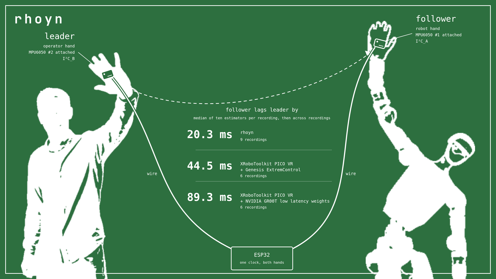
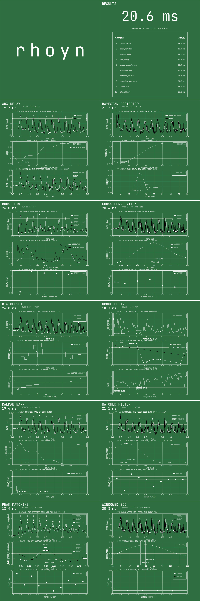
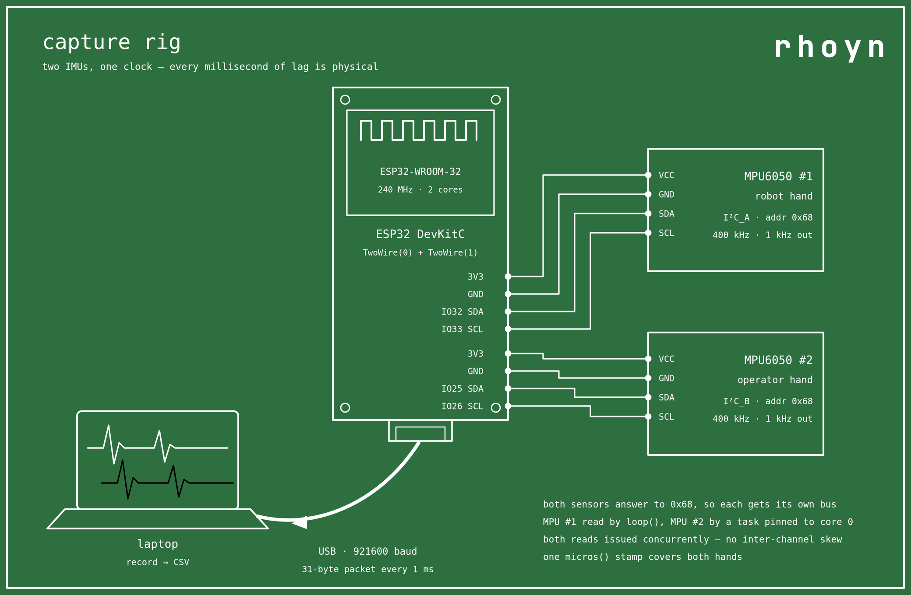
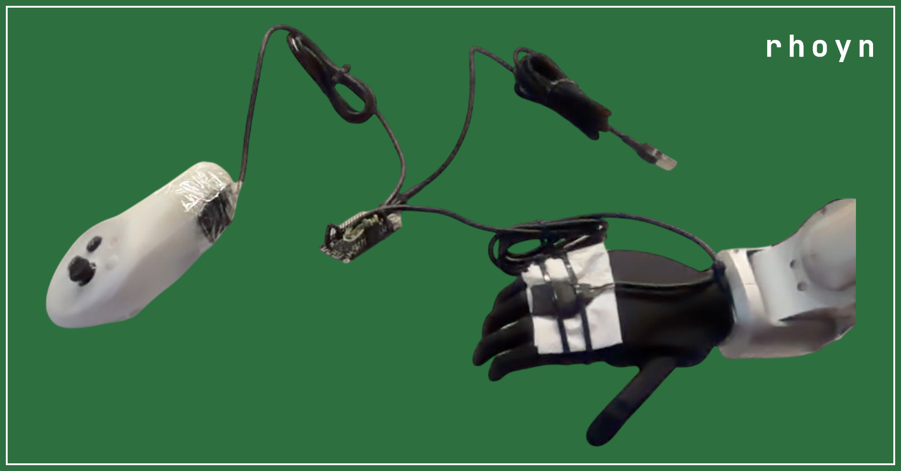

# teleop-hands-latency-analysis

Blog post: [Low latency, accurate hands](https://rhoyn.com/low-latency-accurate-hands?utm_source=github)

Compute latency between teleoperated follower humanoid movement and the human
leader movement.



*Both hands carry an MPU6050 and both are wired to the same ESP32, so the
number is simply how far the follower trails the leader. Three stacks
measured this way, fastest to slowest.*



Measures the end-to-end motion latency of a teleoperation stack — how long the
robot's hand takes to reproduce a movement of the operator's hand — from two
IMUs and nothing else.

Ten independent algorithms measure the same recording. The reported latency is
the **median** across them, which is what makes the number trustworthy: no
single method decides the answer, and a method that fails on a given take
cannot move a median far.

## 1. Prepare the hardware

Two MPU6050 breakouts and one ESP32.

- One MPU6050 rides on the **operator's** hand, the other on the **robot's**
  hand.
- Both are wired to the same ESP32, one per I2C bus (`TwoWire(0)` and
  `TwoWire(1)`, both at address `0x68`).
- `esp32_firmware.cpp` samples both at 1 kHz and stamps every sample with one
  clock. It is an Arduino sketch kept as `.cpp` so the repo formatter covers it
  and so it stays out of `make`; copy it to `esp32_firmware.ino` to build it
  with the Arduino IDE or `arduino-cli`.





*The same rig as built: one MPU6050 on each hand, the ESP32 between them, one
USB cable out.*

The two sensors sharing one clock is the reason this works. There is no
device-to-device clock offset to estimate away, so every millisecond of
measured lag is physical delay.

Mounting orientation does not matter. The algorithms work on gyro **magnitude**
`|w| = sqrt(gx² + gy² + gz²)`, which is identical for any two rigidly related
frames, so the boards need no common orientation and no relative rotation has
to be known. Using gyro rather than accelerometer also sidesteps gravity.

Keep motion inside the MPU6050's default ±250 dps; clipped peaks distort every
estimator.

## 2. Record a teleoperation session

Drive the robot through the teleoperation stack while both hands move.

https://github.com/user-attachments/assets/fd2c47e6-f865-4094-b8b7-8ec69fdd55b8

https://github.com/user-attachments/assets/d4483f16-5d83-4a0c-9405-039fa446c65e

*Two takes at the full 60 fps: the leader hand moves, the follower humanoid
follows. The same clips are in `assets/preview_0.mp4` and
`assets/preview_1.mp4`.*

Every experiment was filmed. `videos/` holds one recording per session, named
to match its CSV in `inputs/` and its grid in `outputs/`, plus a
`_preview.jpg` still taken from the middle frame of each. The video is not
used by the analysis — the latency comes entirely from the two IMUs — but it
is what lets you go back and see what the hands were actually doing on any
take whose numbers look odd.

**Move in bursts with rests between them.** Sharp starts and stops carry the
timing information every algorithm keys on; smooth continuous motion carries
much less, and completely still stretches are gated out. Ten to twenty reaches
over five to twenty seconds is a good take.

A session is a CSV, one row per millisecond:

```
t_us,m1_ax_g,m1_ay_g,m1_az_g,m1_gx_dps,m1_gy_dps,m1_gz_dps,m2_ax_g,...,m2_gz_dps
```

`m1` is the **robot** hand, `m2` the **operator** hand. `t_us` is the ESP32's
microsecond clock and is allowed to wrap; the loader handles that.

`recorder.cpp` is the host side that writes it. Point it at the ESP32 and it
reads until you stop it:

```sh
./record.sh --port /dev/ttyUSB0 --out inputs/my_take.csv
```

`--port` defaults to `/dev/ttyUSB0`, `--baud` to 921600 and `--out` to
`mpu_log.csv`. It resynchronises on the `0xAA 0x55` pair at every packet
rather than trusting the stream to stay aligned, checks the XOR checksum and
drops the packet if it fails, and converts the raw counts to g and degrees per
second on the way out, so the CSV reads on its own. Ctrl-C stops it and
flushes; the running `samples | rate | bad` line on stderr is what tells you
the rig is alive before a take rather than after it. A healthy run sits near
1000 samples/s with `bad` at zero.

The recordings in `inputs/` were made with an earlier build of this same
program. Any logger that writes the header above will do.

## 3. Compute the latency

```sh
./run.sh inputs/rhoyn_0.csv outputs/rhoyn_0.jpg
```

`run.sh` builds and execs in one step. Both arguments are required; there are
no flags. The binary is the same two arguments:

```sh
make
./build/teleop-hands-latency-analysis INPUT.csv OUTPUT.jpg
```

`make` builds both binaries. `make build/teleop-hands-recorder` builds the
recorder on its own, which is what you want on the machine the ESP32 is
plugged into.

Ten algorithms run over the recording, each producing one latency estimate
and one 800x800 tile explaining how it got there. stdout carries the numbers:

```
median over 10/10 algorithms: 20.6 ms (MAD 0.9 ms)
  arx_delay            19.7 ms  ok  ARX(2,3) 500Hz, loss drop 33%, 4 blocks
  bayesian_posterior   21.2 ms  ok  MAP 21.2 ms, 95% CI 15.2-27.4 ms, gain 0.71
  ...
```

The JPEG is a 2-column grid: the logo, a results table sorted by latency, and
the ten algorithm tiles.

The number is **how far the robot lags the operator**, in milliseconds. The
robot is taken to follow always — the only direction a working teleoperation
link can produce — so the tool reports the magnitude and never a negative lag.

### The ten algorithms

| algorithm | approach |
|---|---|
| `windowed_gcc` | windowed cross-correlation with rest gating and Gaussian peak refinement |
| `cross_correlation` | plain-weighted generalized cross-correlation, one tau per window |
| `group_delay` | Welch H1 transfer function, delay from the coherence-weighted phase slope |
| `arx_delay` | ARX model with an explicit delay parameter, searched over a grid |
| `kalman_bank` | 201 Kalman filters, one per delay hypothesis, likelihood vote |
| `dtw_offset` | banded dynamic time warping, offset of the warping path |
| `burst_dtw` | subsequence DTW per motion burst, median across bursts |
| `matched_filter` | one operator burst as a template, slid over the robot burst |
| `peak_matching` | the speed peak of each reach on both hands, and the gap between them |
| `bayesian_posterior` | posterior over tau with the amplitude gain profiled out, MAP plus 95% CI |

An algorithm may **abstain** on a recording it cannot measure. That is a
result, not an error: the run continues, the tile reads "rejected", and the
median forms from the rest.

`peak_matching` is the one to show a non-technical audience. Its middle panel
zooms one reach, marks both speed peaks, and brackets the gap in milliseconds.

## Results

Every algorithm against every recording, in milliseconds. Rows are the
recording index within that stack, so row `3` is `inputs/<stack>_3.csv`, its
grid `outputs/<stack>_3.jpg` and its video `videos/<stack>_3.mp4`. The last
column is the median across the ten algorithms, which is the number the tool
reports for that recording.


### rhoyn

| # | arx | bayes | bdtw | xcorr | dtw | phase | kalman | match | peak | gcc | **med** |
|---|---|---|---|---|---|---|---|---|---|---|---|
| 0 | 19.7 | 21.2 | 26.0 | 20.4 | 26.0 | 18.3 | 19.6 | 21.1 | 18.4 | 20.8 | **20.6** |
| 1 | 19.7 | 19.2 | 18.0 | 20.4 | 18.0 | 19.8 | 19.6 | 17.0 | 17.3 | 20.3 | **19.4** |
| 2 | 18.8 | 18.7 | 17.0 | 17.4 | 17.0 | 16.8 | 18.7 | 16.6 | 15.4 | 17.4 | **17.2** |
| 3 | 20.3 | 21.2 | 22.0 | 19.4 | 23.0 | 20.3 | 20.3 | 19.8 | 19.3 | 19.2 | **20.3** |
| 4 | 17.0 | 17.5 | 20.0 | 17.4 | 19.0 | 17.4 | 17.1 | 19.0 | 18.9 | 17.8 | **17.7** |
| 5 | 19.6 | 21.0 | 24.0 | 20.0 | 23.0 | 25.8 | 19.6 | 20.5 | 31.5 | 20.0 | **20.8** |
| 6 | 21.8 | 21.4 | 20.0 | 19.8 | 20.0 | 25.3 | 21.7 | 22.6 | 22.9 | 19.8 | **21.6** |
| 7 | 20.6 | 19.9 | 17.0 | 18.2 | 19.0 | 19.3 | 20.7 | 19.2 | 20.9 | 18.1 | **19.2** |
| 8 | 21.8 | 20.4 | 21.0 | 19.1 | 20.0 | 24.6 | 21.9 | 17.7 | 22.9 | 19.1 | **20.7** |

**rhoyn median: 20.3 ms** over 9 recordings.


### XRoboToolkit PICO VR + Genesis ExtremControl

| # | arx | bayes | bdtw | xcorr | dtw | phase | kalman | match | peak | gcc | **med** |
|---|---|---|---|---|---|---|---|---|---|---|---|
| 0 | 41.9 | 52.4 | 55.0 | 45.3 | 52.0 | 49.2 | 41.6 | 48.9 | 48.1 | 45.3 | **48.5** |
| 1 | 45.4 | 50.4 | 48.0 | 47.2 | 48.0 | 47.5 | 45.1 | 49.8 | 51.2 | 47.0 | **47.7** |
| 2 | 41.0 | 46.3 | 48.0 | 45.8 | 49.0 | 41.1 | 40.4 | 47.8 | 45.5 | 45.9 | **45.9** |
| 3 | 46.1 | 43.2 | 44.0 | 43.1 | 43.0 | 42.7 | 46.7 | 45.6 | 41.1 | 42.9 | **43.2** |
| 4 | 38.7 | 39.2 | 46.0 | 39.3 | 34.0 | 38.2 | 39.1 | 38.2 | 39.8 | 39.2 | **39.1** |
| 5 | 32.4 | 36.4 | 38.0 | 37.2 | 42.0 | 36.5 | 32.7 | 37.6 | 38.5 | 37.3 | **37.2** |

**XRoboToolkit PICO VR + Genesis ExtremControl median: 44.5 ms** over 6 recordings.


### XRoboToolkit PICO VR + NVIDIA GR00T low latency weights

| # | arx | bayes | bdtw | xcorr | dtw | phase | kalman | match | peak | gcc | **med** |
|---|---|---|---|---|---|---|---|---|---|---|---|
| 0 | 90.9 | 87.9 | 92.0 | 83.9 | 89.0 | 79.8 | 91.0 | 88.4 | 75.4 | 85.1 | **88.2** |
| 1 | 115.7 | 99.3 | 95.0 | 94.5 | 98.0 | 87.6 | 115.7 | 93.5 | 81.5 | 94.7 | **94.9** |
| 2 | 68.4 | 80.0 | 72.0 | 70.5 | 67.0 | 61.1 | 68.6 | 76.9 | 65.6 | 70.6 | **69.5** |
| 3 | 78.4 | 94.6 | 93.0 | 90.5 | 86.0 | 90.5 | 78.2 | 89.8 | 94.5 | 90.5 | **90.5** |
| 4 | 87.7 | 92.1 | 88.0 | 87.0 | 88.0 | 87.8 | 87.3 | 88.5 | 87.7 | 86.8 | **87.7** |
| 5 | 96.8 | 99.7 | 103.0 | 98.0 | 96.0 | 101.6 | 96.9 | 99.3 | 100.2 | 98.0 | **98.7** |

**XRoboToolkit PICO VR + NVIDIA GR00T low latency weights median: 89.3 ms** over 6 recordings.


### Comparison

| teleop stack | recordings | median latency | vs rhoyn |
|---|---|---|---|
| rhoyn | 9 | **20.3 ms** | — |
| XRoboToolkit PICO VR + Genesis ExtremControl | 6 | **44.5 ms** | 2.2x slower |
| XRoboToolkit PICO VR + NVIDIA GR00T low latency weights | 6 | **89.3 ms** | 4.4x slower |

The three stacks do not overlap: every rhoyn recording is faster than every
recording from either competitor.

### Against the published field

The ExtremControl paper [1] estimates the end-to-end latency of ten humanoid
teleoperation systems by running optical flow over each project's released
videos. Their Table I, re-sorted by latency and reduced to the latency column,
with rhoyn added:

| teleoperation system | control interface | end-to-end latency |
|---|---|---|
| **rhoyn (ours)** | VR | **~20 ms** |
| ExtremControl | VR, MoCap | ~54 ms |
| CLONE | VR | ~178 ms |
| OmniH2O | VR | ~185 ms |
| AMS | MoCap | ~201 ms |
| TWIST2 | VR | ~234 ms |
| HumanPlus | RGB Camera | ~340 ms |
| H2O | RGB Camera | ~373 ms |
| AMO | VR | ~380 ms |
| HOMIE | Exoskeleton | ~454 ms |
| TWIST | MoCap | >700 ms |

**The two instruments are not the same, and the gap is wide enough that it
matters.** Every row but the first is optical flow read off a published video,
so its resolution is bounded by that video's frame rate — a 30 fps clip cannot
resolve better than about 33 ms, which is more than rhoyn's whole latency. The
rhoyn row is the median of ten IMU estimators over nine recordings, the 20.3 ms
from the table above, rounded to the precision the other rows can support.
Read the column as an order-of-magnitude ranking, not as ten numbers measured
the same way.

One row overlaps this repository's own measurements. The stack measured above
as XRoboToolkit PICO VR + Genesis ExtremControl came out at **44.5 ms**, against
the ~54 ms MoCap and ~64 ms VR the paper reports for ExtremControl. Two
instruments, one system, and the IMU number is the faster of the two — which is
the direction that should reassure you about the method here, not the reverse.

[1] Ziyan Xiong, Lixing Fang, Junyun Huang, Kashu Yamazaki, Hao Zhang, Chuang
Gan. *ExtremControl: Low-Latency Humanoid Teleoperation with Direct Extremity
Control.* arXiv:2602.11321. https://arxiv.org/abs/2602.11321

## What the number includes

Everything mechanical and computational between the two boards — tracking,
network, controller, actuation. That is the point, it is the latency the
operator actually feels, but it means a compliant or slow joint counts as
latency here just as much as a network hop does. It is not a measurement of
any single link in the chain.

The robot also **attenuates and low-passes** the operator's motion rather than
reproducing it exactly. Methods that assume a pure delayed copy are biased by
that; `group_delay` is not, because it reads only phase.
